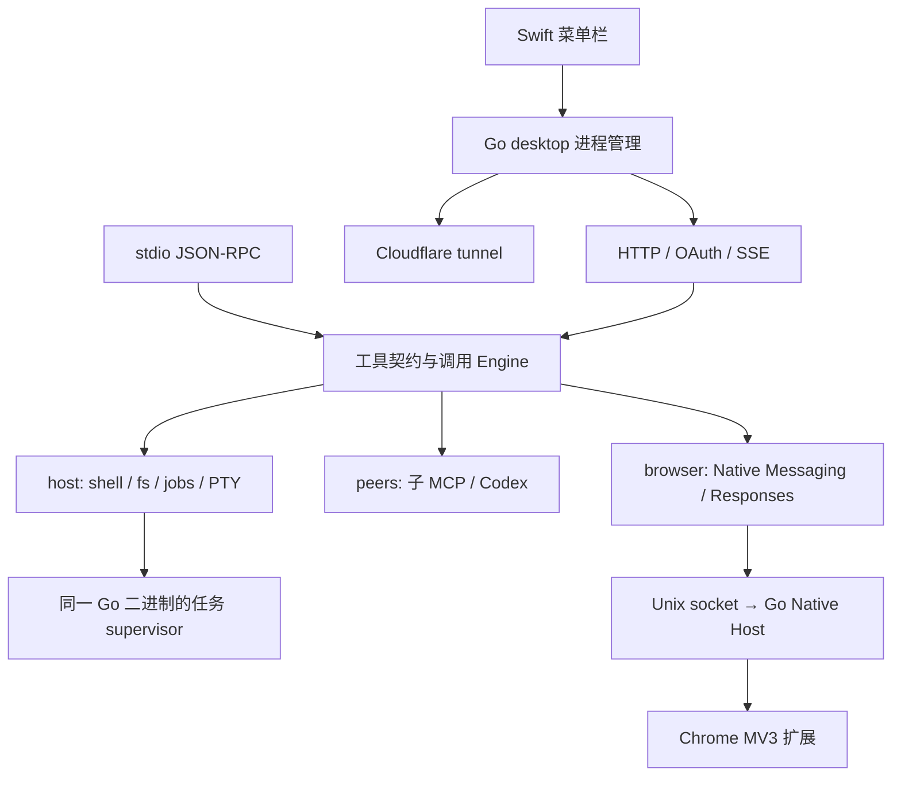

# 架构

所有入口汇合到同一个 `Engine.Call`：参数验证、解锁状态、取消检查、调用和审计在这里统一处理。HTTP Responses 适配编译出的浏览器回合也走该路径。

## 模块边界

| 模块 | 对外边界 | 内部持有的复杂度 |
|---|---|---|
| `internal/core` | Config、Tool、Result、Fault、原子 JSON 写入 | 唯一的公开工具 Schema 与通用值处理 |
| `internal/server` | Engine、stdio、HTTP | 协议版本、请求生命周期、取消、SSE、OAuth 状态、审计 |
| `internal/host` | Call / Status / Close | 子进程、退出码、独立 supervisor、日志边界、文件替换、PTY 内核操作 |
| `internal/peers` | Call / Tools / Status / Close | 子 MCP 握手、路由、重启、健康检查、临时 Codex 客户端 |
| `internal/browser` | Call / Status / Responses / NativeHost | socket、native framing、profile、参数翻译、Responses 编译与校验 |
| `cmd/macbridge` | 命令行与进程入口 | 所有权、安装、配置、停机、隧道，不实现具体工具 |

使用具体模块和小函数接口；没有插件容器、DI 框架、消息总线或抽象持久层。Go 标准库承担 HTTP、JSON、加密、同步、进程与文件系统；PTY 库只提供跨平台伪终端创建。

## 关键工程选择

- **一个原生进程负责核心工具。** HTTP 不再通过启动另一套 JS bridge 中转调用。后台任务 supervisor 使用同一可执行文件。
- **进程归属可核实。** 正常退出回收直接拥有的进程；异常退出后通过记录的启动身份核实 PID，清理结果可区分完成和不完整。
- **完成与运行状态分开。** 后台任务记录终态而非只看 PID；日志保留有界尾部。PTY 使用绝对字节游标，重复读取不会消费输出。
- **文件替换防止半写入。** 默认临时文件 fsync 后 rename，SHA-256 是可选的修改前置条件。文件写操作在一个 host 实例内串行；外部编辑器与其他实例不参与该锁。
- **并发请求独立取消。** stdio 在分发前注册请求；HTTP 的状态会话使用独立取消表。无 session header 的兼容请求不共享取消 ID。
- **子 MCP 不持有本机工具的生命周期。** 服务启动与提供方的首次握手分离，工具目录等待初次发现；shell/fs 不受慢提供方阻塞。
- **浏览器实现按行为拆分。** workspace、页面 DOM、ChatGPT 会话和任务诊断各持有自己的状态。自动化不复制页面凭据到服务端。

## 有意保留的边界

这是本机开发桥接，不是多租户服务。审计和一般 transport 日志未设计为远端日志平台；desktop transport 日志在启动时按大小轮换，长期运行可结合系统日志轮换。

PTY 不支持服务重启后重连；后台任务支持。SHA-256 前置条件不提供针对任意外部写入者的事务语义。

Cloudflare 命名隧道自动发现支持常见标量 YAML 配置，并匹配 loopback 服务端口；别名和 flow-style YAML 不参与自动发现，可自行运行隧道并配置固定 `publicURL`。

ChatGPT 网页内部接口由上游控制，因此保留 runtime/raw 两条实现及可诊断的错误。原项目 hardcoded 的单个私人任务 ID 已替换成显式 task ID 或当前任务发现；不把作者个人数据写入新项目。
